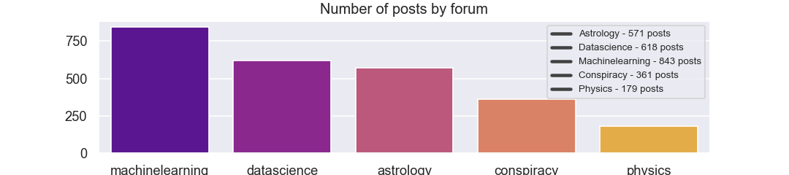

# Training a semantic classifier with Reddit data

The following code pulls the 1000 newest posts
from each forum in a list of subreddits,
and fits model to the corpus in order to
predict the forum of origin for unseen data.

]

## Models

Two models were used in this demo

- RandomForrestClassifier

- LogisticRegressionCV

## Analysis

Their performace is compared below

### Random Forrest Classifier


### Logistic Regression Cross-Validation


A script-version of this code is also included,
along with ```requirements.txt```

To run this demo as a script, simply clone this repo
and execute the following from your command line

    pip install requirements.txt
    python classify_subreddits.py

Change the parameters in the ```parameters.py``` file if you'd like
