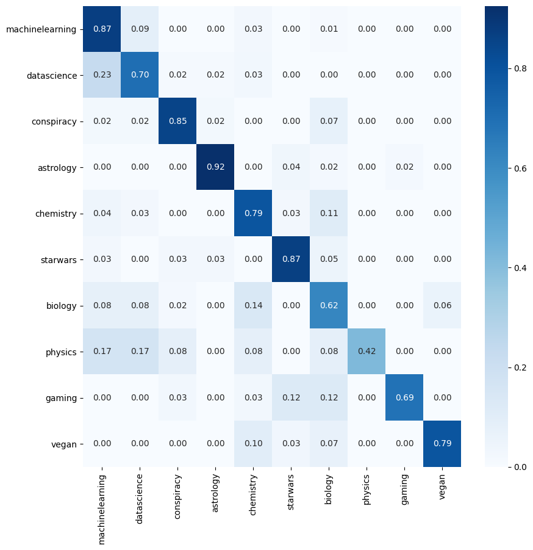

## Training a semantic classifier with Reddit data

The following code pulls the 1000 newest posts from each designated subreddit, vectorizes each post and uses logistic regression to predict the subreddit of origin.

### Update (12/20)

Added mongoDB functionality to save both the text data and hyperparameters for our model/pipeline. The trained model is saves as  ```TFIDF_SVD_LRCV.pkl``` and
is included in this repository

### Results

```
                 precision    recall  f1-score   support

machinelearning       0.72      0.87      0.79        78
    datascience       0.74      0.70      0.72        64
     conspiracy       0.88      0.85      0.86        41
      astrology       0.94      0.92      0.93        53
      chemistry       0.78      0.79      0.79        72
       starwars       0.79      0.87      0.82        38
        biology       0.58      0.62      0.60        50
        physics       1.00      0.42      0.59        12
         gaming       0.96      0.69      0.80        32
          vegan       0.88      0.79      0.84        29

       accuracy                           0.78       469
      macro avg       0.83      0.75      0.77       469
   weighted avg       0.80      0.78      0.78       469

```   

