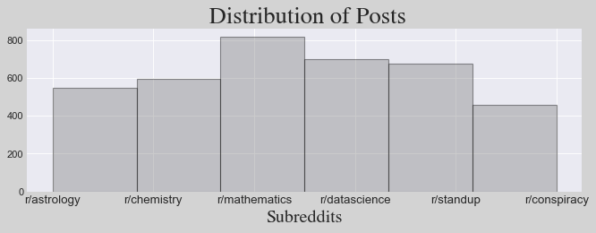
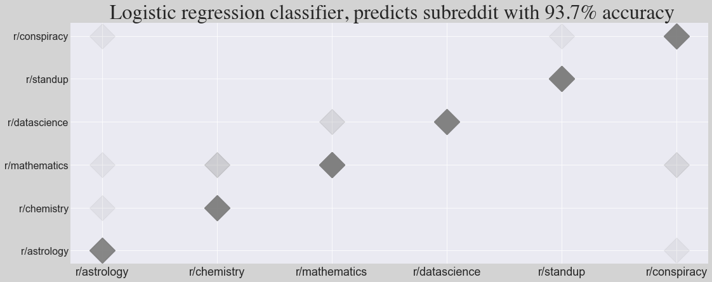

## Training a semantic classifier with Reddit data

The following code pulls the 1000 newest posts from each designated subreddit, vectorizes each post and uses logistic regression to predict the subreddit of origin.

]
]
